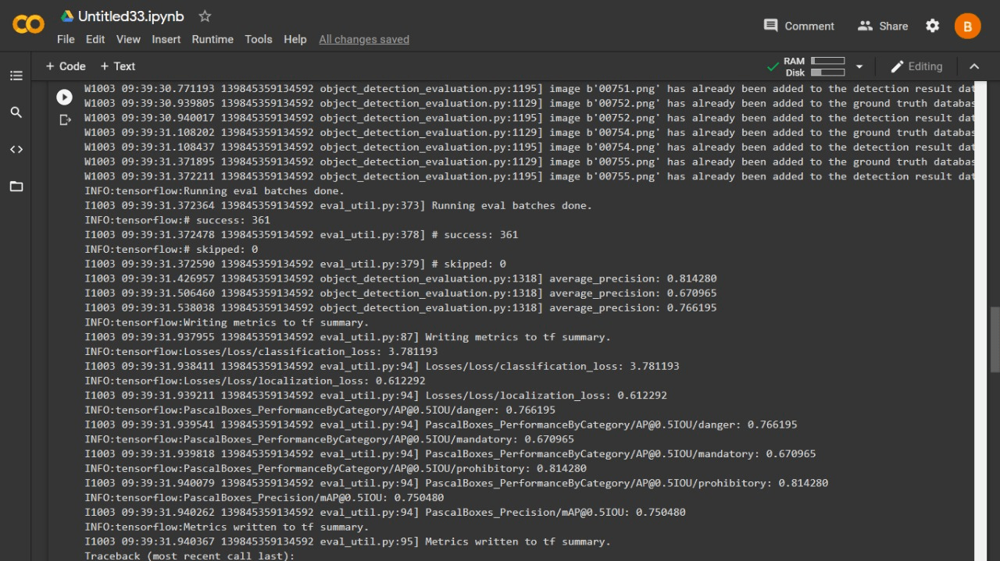
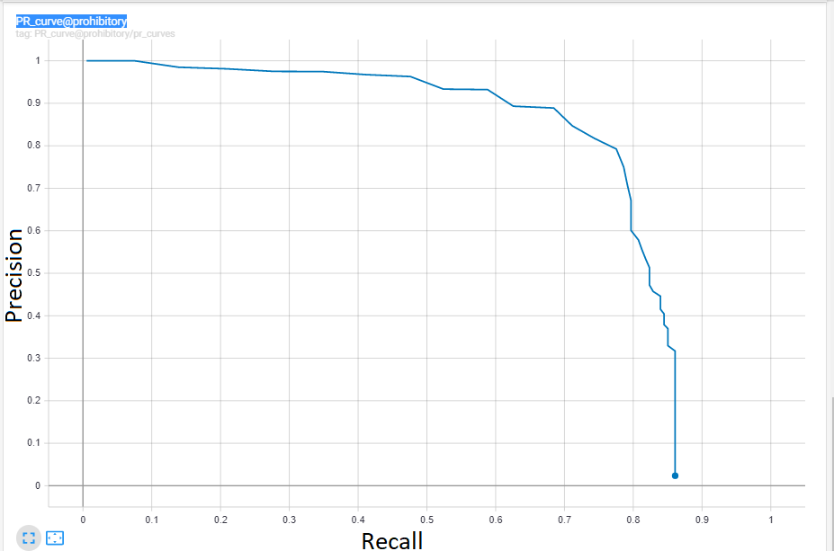
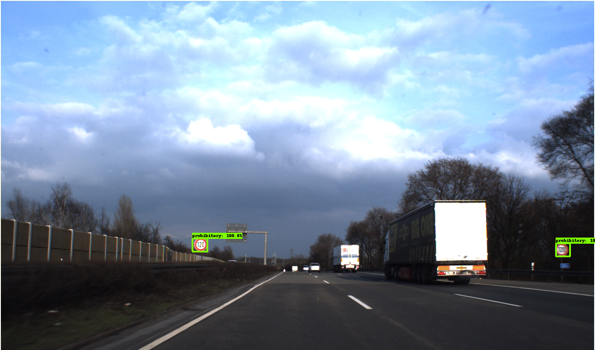

# Real-Time-Traffic-Sign-Detection
I have trained SSDlite-MobilenetV2 Model on GTSDB. I was able to achieve 75% mAP on testing dataset of GTSDB. It took me 22768 steps to train the model. Afterwards my validation accuracy started to decrease.  
The reason why i selected SSDlite because we made use of researchers work which shows that ssd-mobilnet is the fastest and lightest model in terms of memory consumption.Further details can be found in this link. https://github.com/aarcosg/traffic-sign-detection  
In the link above, they have discussed about ssd model instead of ssdlite. SSDlite is slightly better in terms of FPS on embedded device.  
I also trained ssd-mobilenetv2 with ssdlite-mobilenetv2. After training both models,i have concluded that both have same mAP on testing dataset .While during implementation on raspberry pi 4 , we had 30% more FPS using ssdlite.  
Here are the steps i did in order to train a model:    
1. First of all i downloaded the GTSDB dataset from this link https://sid.erda.dk/public/archives/ff17dc924eba88d5d01a807357d6614c/published-archive.html  
2. The dataset is in PPM format so i converted them to png format through the code i provided in (ppm to png.py) above in files section.  
3. Then i created tensorflow record(tfrecord) file.Generate_tfrecord.py is also provided above in order to convert images and csv file into tfrecord. You can take help from the link https://github.com/EdjeElectronics/TensorFlow-Object-Detection-API-Tutorial-Train-Multiple-Objects-Windows-10  
4. After creating tfrecord file, i migrated to Google Colab since i didn't had access to heavy GPU and CPU.  
5. I used premium account in order to train the model.It took me 6-8 hours straight to train the model using p100 gpu.  
6. I have also provided model's config file in Model folder. You can download the model using this link https://github.com/tensorflow/models/blob/master/research/object_detection/g3doc/tf1_detection_zoo.md  
7. I have attached the labelmap.pbtxt file which was used in order to train model on GTSDB.  
8. I trained the model twice.First time with training dataset(containing 600 images) and validation dataset(300 images which is originally for testing ).Once i got the approximate number of steps around which my model trained for the first time. On second run , i trained the model straight to that number of steps that is 22768.(The reason i didn't train the model in single run only because i had limited 900 pictures only in which 600 for training and 300 for testing. I didn't want to further split training dataset into (training and validation dataset).  
9. i have attached a picture in results folder of mAP calculated during first training run with name mAP1  and for second training picture is named as mAP2 available in results folder.  
10. I have also attaced PR(precision recall) curves of it in the results folder.One PR curve out of three is shown here.It is for prohibitory sign.  
Testing samples are also attached in result folder.Two of the testing images are shown below.   

11. Inference graph of my model can be downloaded from the link. https://drive.google.com/file/d/1CEd_Grc3Vqmlmko0U6ggWEAtGspkwxrA/view?usp=sharing  
12. Then i implemented this model on raspberry pi 4. I got FPS from (1.6 - 2.1) FPS.  
13. I also added audio assist system to it. The model says the name of the class of traffic sign it detected.    
  

